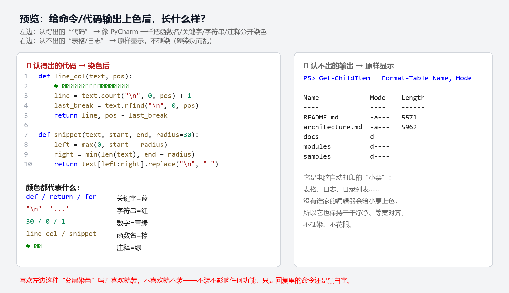

# dsh-tool-highlight

[](./LICENSE)
[](https://www.npmjs.com/package/dsh-tool-highlight)
[](https://github.com/vollegrewar/dsh-tool-highlight)

> DeepSeek Harness（DSH）web 插件：给 **bash / pwsh 命令**与 **read 的代码输出**做**分层语法染色**（VS Code Dark+ 风格：关键字/字符串/数字/函数名/注释各一色）。**认得出来才染，表格/日志保持原样。**

纯前端渲染，**不新增、不改写任何会话内容，不调用模型 —— 零 token 开销**。

## 效果

- **read 代码文件** → 按扩展名识别语言（`.py .js .ts .json .ps1 .sh ...`），PyCharm 式分词染色
- **bash / pwsh 输出** → 内容启发式识别：像 JSON 按键/字符串/数字分色；像代码按语法分色；**表格/日志保持原样**（硬染反而花眼）
- 附带退出码状态条（绿=成功 / 红=非零退出或信号）

**效果预览图（左：代码染色 / 右：表格原样）：**



## 安装

```bash
# 方式一：npm（推荐，即装即用）
dsh plugin --profile web add dsh-tool-highlight

# 方式二：GitHub 源
dsh plugin --profile web add github:vollegrewar/dsh-tool-highlight

# 方式三：本地 link（开发用）
dsh plugin --profile web add link:/path/to/dsh-tool-highlight
```

装完 **重启 dsh web 并硬刷新**（Ctrl+Shift+R）。

> 若用 GitHub 源安装遇到 pnpm 的 `allowBuilds` 提示，按提示把 `dsh-tool-highlight` 加进 profile 的 `pnpm-workspace.yaml` 白名单即可；本插件无构建脚本，npm 安装不会触发。

## 与 dsh-better-tool-ui 共存

本插件只接管 `read / bash / pwsh` 三个工具卡（priority -2），
`dsh-better-tool-ui` 继续负责 write/edit 的 diff、彩色状态条等其余工具——**各管各的，互不冲突**。
不装 better-tool-ui 也能单独使用。

## 工作原理

- 挂在 DSH 官方空 keyed 槽位 `tool.call.toolview` 上，按工具名注册渲染器
- 语言识别：`read` 按文件扩展名；命令输出按内容启发式（JSON 可解析 → JSON；代码特征行 ≥2 → Code；否则纯文本）
- 分词染色器为自研轻量正则（零运行时依赖），配色 VS Code Dark+，明暗主题跟随 DSH 主题 token

## 常见问题

**会增加 token 消耗吗？** 不会。纯前端渲染：不改写会话内容、不调用模型，读取已有文本重新上色而已——和把 Word 字变颜色同理。

**为什么表格/日志不上色？** 认不出的内容硬染反而花眼（没人会给打印小票上色）。这是"认得出来才染"的设计，不是缺功能。

**和 dsh-better-tool-ui 冲突吗？** 不冲突。本插件只接管 `read / bash / pwsh`（priority -2），better-tool-ui 继续管其余工具。

## 开发与贡献

- 逻辑测试：`npm test`（无头运行分词器 + 语言识别，失败非零退出）
- 贡献指南见 [CONTRIBUTING.md](CONTRIBUTING.md)，更新记录见 [CHANGELOG.md](CHANGELOG.md)
- English: [README.en.md](README.en.md)

## License

[MIT](./LICENSE)